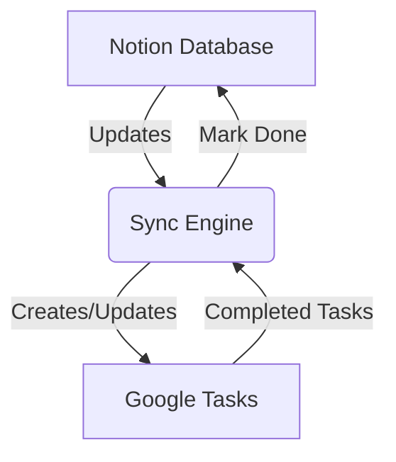

# Notion2GoogleTasks

  

## Overview

**Notion2GoogleTasks** is a bidirectional synchronization engine that keeps your Notion databases and Google Tasks perfectly in sync. Maintain task parity across platforms while leveraging Notion's rich content features and Google Tasks' mobile-friendly interface.

## Features

✨ **Core Functionality**
- **Bidirectional Sync**
  - Automatic updates in both directions (Notion ↔ Google Tasks)
  - Status change propagation (mark complete/incomplete)
  - Smart conflict resolution (last-modified wins)
- **Intelligent Matching**
  - Title-based duplicate prevention
  - Cross-platform ID tracking
  - Automatic task list creation from Notion tags
- **Advanced Configuration**
  - Customizable Notion query filters (status, dates, properties)
  - JSON-based filter configuration
  - Environment-based deployment settings

⚙️ **Technical Capabilities**
- OAuth2 token management for Google API
- Notion API pagination handling
- Config validation with error logging
- Automatic token refresh handling

## Roadmap

🚀 **Planned Improvements**
- Webhook integration for real-time updates
- Custom property mapping configuration

## Limitations

⚠️ **Current Constraints**
- Manual/scheduled sync required (no instant updates)
- Google Tasks API restrictions:
  - Only supports date-based due dates with note datetime values (no time-specific).
- Notion API limitations:
  - Requires specific database schema
  - Rate limits (3-5 requests per second)

## Getting Started

### Prerequisites

**Notion Setup**
1. Integration token with `read` and `update` permissions
2. Database with required properties:
   - `Title` (Text)
   - `Tags` (Multi-select)
   - `Due` (Date)
   - `Status` (Select)

**Google Setup**
1. OAuth 2.0 Client ID with Tasks API access
2. Authorized `https://www.googleapis.com/auth/tasks` scope

## Installation and Usage
For detailed steps, refer to the [Quickstart Guide](./Quickstart.md).

### Requirements
- **Notion**:
    - Notion database ID
    - Query [filter](./services/notion/config/query_payload.json)
    - API KEY 
- **Google API**:
    - OAuth2 client configuration
    - Access token retrieval

## Contributing

Contributions are welcome! Please open an issue or submit a pull request.

## Sync Overview Diagram

