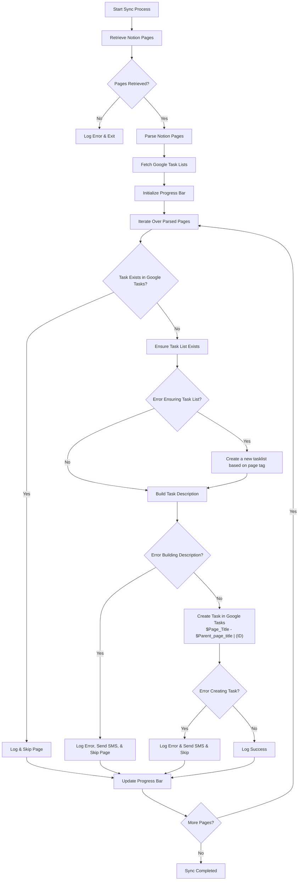

```mermaid
graph TD
    A[Start Sync Process] --> B[Retrieve Notion Pages]
    B --> C{Pages Retrieved?}
    C -->|No| D[Log Error & Exit]
    C -->|Yes| E[Parse Notion Pages]
    E --> F[Fetch Google Task Lists]
    F --> G[Initialize Progress Bar]
    G --> H[Iterate Over Parsed Pages]

    H --> I{Task Exists in Google Tasks?}
    I -->|Yes| J[Log & Skip Page]
    I -->|No| K[Ensure Task List Exists]

    K --> L{Error Ensuring Task List?}
    L -->|Yes| M[Create a new tasklist based on page tag]
    L -->|No| N[Build Task Description]

    M --> N

    N --> O{Error Building Description?}
    O -->|Yes| P[Log Error, Send SMS, & Skip Page]
    newLines["`Create Task in Google Tasks
    $Page_Title - $Parent_page_title | (ID)`"]
    O -->|No| newLines
    %% O -->|No| Q[Create Task in Google Tasks \\ $Page_Title - $Parent_page_title  ID]
    

    newLines --> R{Error Creating Task?}
    R -->|Yes| S[Log Error & Send SMS & Skip]
    R -->|No| T[Log Success]

    J --> U[Update Progress Bar]
    %% M --> U
    P --> U
    S --> U
    T --> U

    U --> V{More Pages?}
    V -->|Yes| H
    V -->|No| W[Sync Completed]
```
