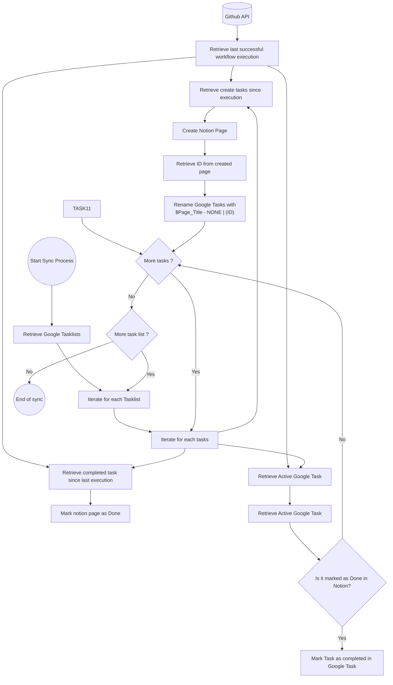

```mermaid
graph TD
    DB1[(Github API)]

    A((Start Sync Process)) --> B[Retrieve Google Tasklists]
    B --> C[Iterate for each Tasklist]
    C --> D[Iterate for each tasks]

    DB1 --> GH[Retrieve last successful workflow execution]
    TASK1[Retrieve completed task since last execution]
    TASK2[Retrieve create tasks since execution]
    TASK3[Retrieve Active Google Task]

    GH --> TASK1
    D --> TASK1
    TASK1 --> TAKS11[Mark notion page as Done]
    TASK11 --> X

    GH --> TASK2
    D --> TASK2
    TASK2 --> TASK21[Create Notion Page]
    TASK21 --> TASK211[Retrieve ID from created page]
    TASK211 --> TASK2111["`Rename Google Tasks with
    $Page_Title - NONE | (ID)`"]
    TASK2111 --> X


    GH --> TASK3
    D --> TASK3
    TASK3 --> TASK31[Retrieve Active Google Task]
    TASK31 --> TASK311{Is it marked as Done in Notion?}

    TASK311 --> |Yes| TASK3111[Mark Task as completed in Google Task]
    TASK311 --> |No| X


    X{More tasks ?}
    X --> |Yes| D
    X --> |No| Y

    Y{More task list ?}
    Y --> |Yes| C
    Y --> |No| Z

    Z((End of sync))
```