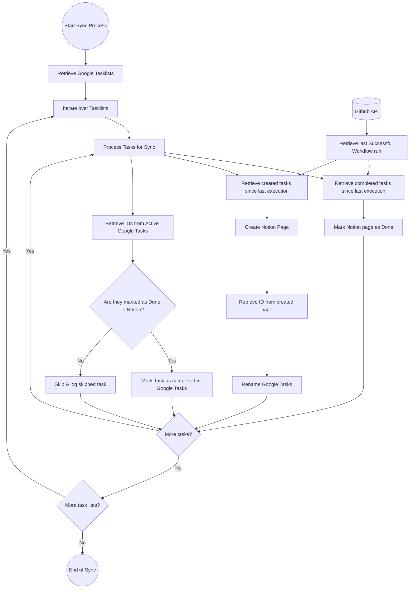
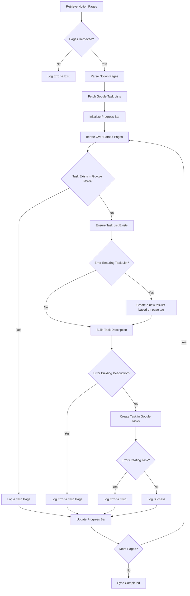

# Google Tasks and Notion Sync Process

This flow combines the synchronization processes between Google Tasks and Notion for both directions: Google to Notion and Notion to Google. The process ensures tasks are updated or created based on their states in each platform.

---

## **Flow Description**
The process involves two main workflows:

1. **Google to Notion Sync**: Tasks in Google Tasks are synchronized with Notion.
2. **Notion to Google Sync**: Notion pages are synchronized with Google Tasks.

Each workflow processes tasks and pages iteratively to ensure both platforms remain consistent.

---

## **Google to Notion Sync Functions**

### **Task 1: Mark Notion Page as Done**
If a task in Google Tasks is marked as **Done**, the corresponding Notion page is updated to reflect this status.
- **Flow Steps:**
  1. Retrieve completed tasks in Google Tasks since the last execution.
  2. Update the associated Notion page to mark it as done.
  3. Check if there are more tasks to process in the current tasklist.

### **Task 2: Create Notion Page for New Tasks**
If new tasks are created in Google Tasks, a corresponding page is created in Notion. The task in Google Tasks is then renamed to include the Notion page ID in the title.
- **Flow Steps:**
  1. Retrieve tasks created in Google Tasks since the last execution.
  2. Create an associated Notion page for each new task.
  3. Retrieve the ID of the created Notion page.
  4. Rename the Google Task to include the Notion page ID in the format: `$Page_Title - NONE | (ID)`.
  5. Check if there are more tasks to process in the current tasklist.

### **Task 3: Sync Active Google Tasks**
For active tasks in Google Tasks:
- Check if the task is already marked as **Done** in Notion:
  - If **Yes**, mark the Google Task as completed.
  - If **No**, skip the task and log it as skipped.
- **Flow Steps:**
  1. Retrieve active Google Tasks.
  2. Check the status of the task in Notion.
  3. If marked as done in Notion, mark it as completed in Google Tasks.
  4. If not marked as done in Notion, skip and log the task.
  5. Check if there are more tasks to process in the current tasklist.

---

## **Notion to Google Sync Functions**

### **Page 1: Sync Notion Pages to Google Tasks**
Notion pages that do not have corresponding Google Tasks are created as tasks in Google.
- **Flow Steps:**
  1. Retrieve Notion pages since the last execution.
  2. For each page, check if a corresponding Google Task exists.
  3. If not, create a new task in Google Tasks using the page details.
  4. Log success or errors as appropriate.

---

## **Google to Notion Sync Diagram**

---

## **Notion to Google Sync Diagram**

