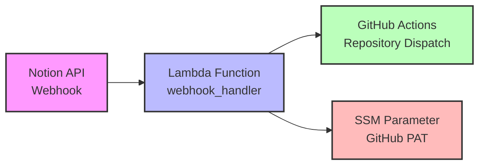

# Notion Webhook Lambda Infrastructure

This directory contains the Terraform configuration for deploying the Notion webhook Lambda function and its supporting AWS resources.

## File Structure

The Terraform configuration has been organized into separate files for better maintainability:

- **`main.tf`** - Terraform and AWS provider configuration
- **`variables.tf`** - All variable definitions
- **`ssm.tf`** - AWS Systems Manager Parameter Store resources for secrets
- **`iam.tf`** - IAM roles and policies for the Lambda function
- **`lambda.tf`** - Lambda function, CloudWatch logs, and Function URL
- **`outputs.tf`** - Output values from the infrastructure
- **`terraform.tfvars.example`** - Example variables file

## Setup

1. Copy the example variables file:
   ```bash
   cp terraform.tfvars.example terraform.tfvars
   ```

2. Edit `terraform.tfvars` with your actual values:
   - AWS region
   - GitHub repository information
   - GitHub Personal Access Token

3. Initialize Terraform:
   ```bash
   terraform init
   ```

4. Plan the deployment:
   ```bash
   terraform plan
   ```

5. Apply the configuration:
   ```bash
   terraform apply
   ```

## How to Obtain the Notion Verification Token

The Notion verification token is provided during the webhook subscription process. Here's how to get it:

### Step 1: Deploy the Lambda Infrastructure First
1. Set a placeholder value for `notion_verification_token` in your `terraform.tfvars`:
   ```
   notion_verification_token = "placeholder-token"
   ```
2. Deploy the infrastructure to get the webhook URL

### Step 2: Create Notion Webhook Subscription
1. Go to your Notion integration settings at https://www.notion.so/my-integrations
2. Select your integration
3. Navigate to the "Webhooks" tab
4. Click "Add webhook endpoint"
5. Enter the Lambda Function URL (from Terraform output: `webhook_url`)
6. Select the events you want to subscribe to
7. Click "Submit"

### Step 3: Extract Verification Token
When you create the webhook subscription, Notion will send a POST request to your Lambda function containing:
```json
{
  "verification_token": "secret_tMrlL1qK5vuQAh1b6cZGhFChZTSYJlce98V0pYn7yBl"
}
```

You can find this token in your Lambda CloudWatch logs:
1. Go to AWS CloudWatch
2. Navigate to Log Groups
3. Find `/aws/lambda/notion2googletasks-webhook-handler-prod`
4. Look for the log entry showing "Received webhook verification request"
5. Copy the `verification_token` value

### Step 4: Update Terraform Configuration
1. Update your `terraform.tfvars` with the actual verification token:
   ```
   notion_verification_token = "secret_tMrlL1qK5vuQAh1b6cZGhFChZTSYJlce98V0pYn7yBl"
   ```
2. Re-run terraform apply:
   ```bash
   terraform apply
   ```

### Step 5: Complete Notion Webhook Verification
1. Go back to the Notion webhook configuration page
2. Click the "⚠️ Verify" button
3. Paste the verification token
4. Click "Verify subscription"

Your webhook is now active and will start receiving events!

## Resources Created

### SSM Parameter Store
- **GitHub PAT** - Secure storage for GitHub Personal Access Token
- **Notion Verification Token** - Secure storage for webhook signature verification

### IAM
- **Lambda execution role** - Allows Lambda to access SSM
- **Lambda policy** - Permissions for CloudWatch logs and SSM

### Lambda
- **Webhook handler function** - Processes incoming Notion webhooks
- **Function URL** - Public HTTPS endpoint for webhook calls
- **CloudWatch log group** - Stores Lambda execution logs

## Outputs

After deployment, you'll get:
- `webhook_url` - The URL to configure in Notion webhooks
- `lambda_function_name` - Name of the deployed Lambda function
- `github_pat_parameter_name` - SSM parameter name for the GitHub PAT

## Security

All sensitive values (tokens, secrets) are stored in AWS Systems Manager Parameter Store as SecureString parameters, encrypted with AWS KMS.

## File Organization Benefits

This modular approach provides several advantages:

1. **Maintainability** - Each service/component is in its own file
2. **Readability** - Easier to find and understand specific resources
3. **Collaboration** - Multiple team members can work on different files
4. **Reusability** - Individual components can be easily reused
5. **Version Control** - Changes to specific components are isolated


## Architecture Diagram

